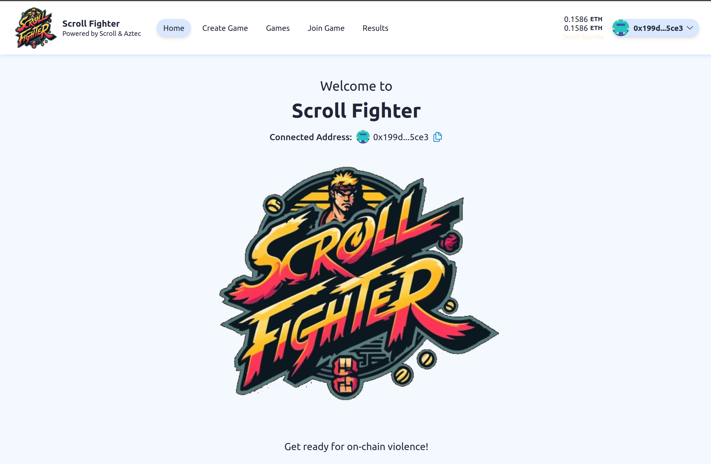
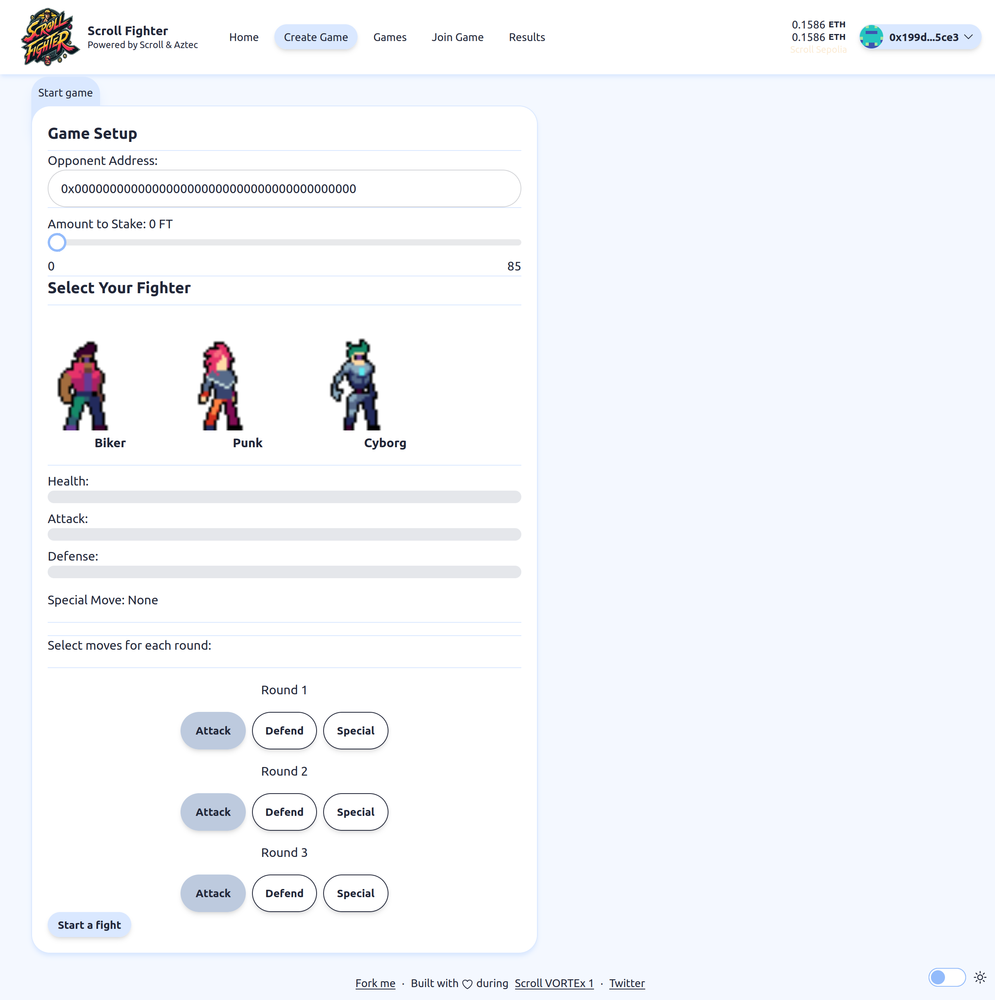
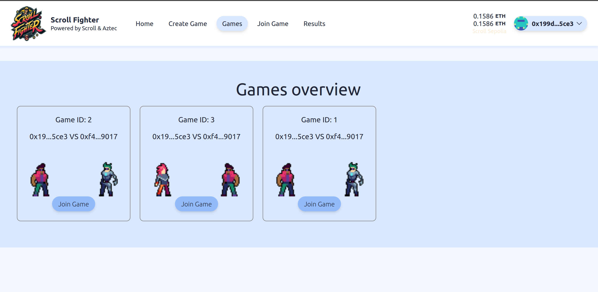
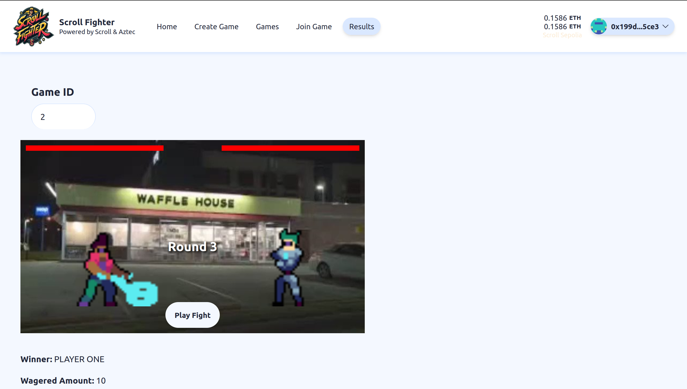

  <h1 align="center">Scroll Fighter </h1>
  <h3>Bringing violence on-chain with Scroll and Noir</h3>
  

🎮 Scroll Fighter is an innovative, blockchain-based fighting game that lives on the Scroll network. This game uses Scroll smart contracts and Noir contracts on Aztec to ensure secure and proofably fair fights..

⚙️ Built on Scroll, Aztec, The Graph and NextJS.

## Screenshots

| Landing Page                                   | Create Game                              |
| ---------------------------------------------- | ---------------------------------------- |
|  |  |

| Games Overview                         | Play Game                            |
| -------------------------------------- | ------------------------------------ |
|  |  |

## Partner Bounties

### Aztec

A contract written in Noir is used to verify the validity of the challenger's committed strategy. By providing a proof generated by Noir, the game smart contract can use the on-chain verifier to ensure the strategy is valid. The Noir verifier checks if the fighter exists and if the moves are valid.

- [Noir circuit](https://github.com/arjanjohan/scroll-fighter/blob/33e5e043bd6b3beb35e60fb84cbf66c5dde24264/packages/noir/circuits/src/main.nr)
- [UltraVerifier on Scroll Sepolia](https://sepolia.scrollscan.com/address/0x06cA44b817F9172e1BaB3a8e8a36020AeC6D7e8d#code)

### Sindri

Scroll Fighter uses Noir and Sindri to generate proofs using the Sindri API. A very smooth and developer friendly way to interact with zk-proofs.

- [Sindri configuration](https://github.com/arjanjohan/scroll-fighter/tree/33e5e043bd6b3beb35e60fb84cbf66c5dde24264/packages/noir)
- [Sindri frontend intregation](https://github.com/arjanjohan/scroll-fighter/blob/2f9f2b9487f9a2df05dee49a2c94bd32b3fa2c13/packages/nextjs/components/GameForm.tsx#L154)

### The Graph

A subgraph is created to query created games on the ScrollFighter contract. Check out the games tab to see a nice overview of games that are retrieved from the subgraph. Please check out the screenshot above to see the games overview (it's not part of the demo video, because I completed this part very last minute).

- [Subgraph code](https://github.com/arjanjohan/scroll-fighter/tree/main/packages/graph).
- [Subgraph endpoint](https://api.studio.thegraph.com/query/72991/scrollfighter/version/latest)
- [Games overview on Vercel](https://scrollfighter.vercel.app/games)
- [Games overview on Github](https://github.com/arjanjohan/scroll-fighter/tree/3b7dd99d66a4344f5cfbd80556526ac1181fb7a9/packages/nextjs/app/games)

### Ankr

This project uses Ankr RPC to deploy the game smart contracts. See the hardhat config file [here](https://github.com/arjanjohan/scroll-fighter/blob/1784b9fefb680b3d1a046fe318004f25a14a7aad/packages/hardhat/hardhat.config.ts#L106).

## Next steps

Due to the limited time, I could not complete everything I set out to do. Additional features that I plan to add are:

- Allow challengers to start open games (anyone can join/accept)
- Complete and polish up game display animations

## Links

- [Vercel deployment (not latest version)](https://scrollfighter.vercel.app/)
- [Presentation slides](https://docs.google.com/presentation/d/1IYbLM9cwdpbuSvShZCdJoJ4JEDa683sMTGp3Bh6K79o/edit?usp=sharing)
- [Presentation video](https://www.loom.com/share/bf35511f16b140e98bf324ac79085769?sid=247ee967-9e0c-4594-88cf-a2f3587ee6b9)
- [Dorahacks BUILD](https://dorahacks.io/buidl/11485)
- [GitHub](https://github.com/arjanjohan/scroll-fighter)

### Verified smart contracts

- [ScrollFighter](https://sepolia.scrollscan.com/address/0x16d4fAD899F2c925AB3e7293F081545Dd08d73B6#code)
- [FighterCoins](https://sepolia.scrollscan.com/address/0x64CDeB6CD5ecfB002bdaFabc98B5C883C5C06B27#code)
- [UltraVerifier](https://sepolia.scrollscan.com/address/0x06cA44b817F9172e1BaB3a8e8a36020AeC6D7e8d#code)

## Team

This project was build for the Scroll VORTEx 1 hackathon by:

- [arjanjohan](https://x.com/arjanjohan/)
